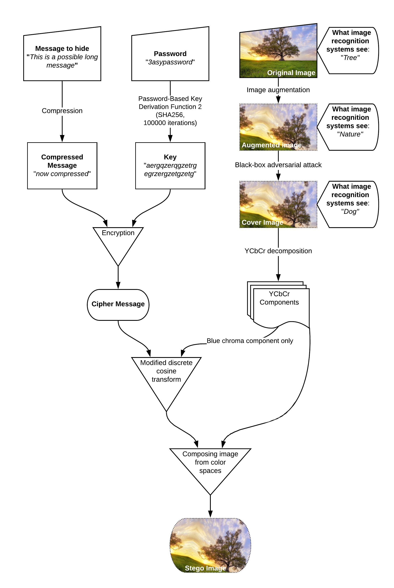
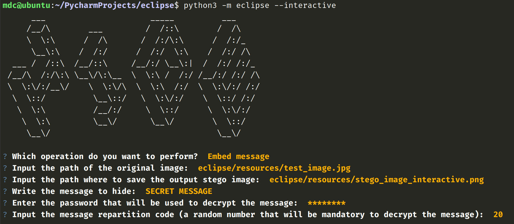
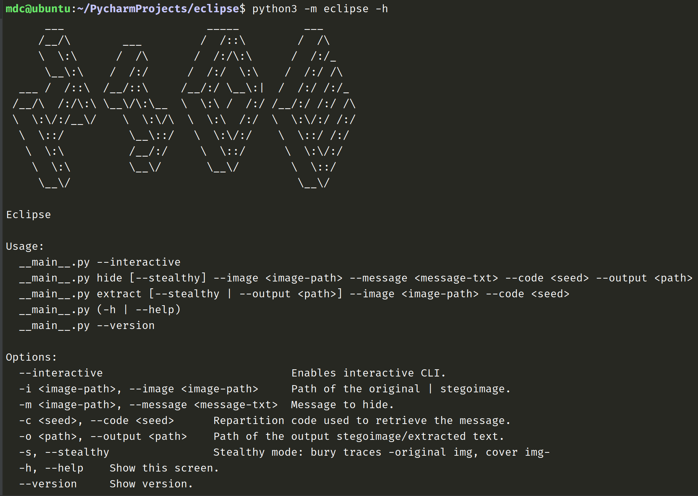

# Eclipse - Image Steganography Tool

Eclipse is a **steganography command-line tool** (and module) that can be used to hide and extract messages from images.

## Goal
*Eclipse* aims to be an **efficient tool** for image steganography, combining different concepts of computer science, such as **cryptography**, **compression** and **machine learning**.

## How it works
In contrast, to secure communication, where an encrypted message is exchanged publicly, the main goal of steganography is to hide the message, so it is difficult to detect the transfer and in a worst-case scenario, even more challenging retrieving the original message. Hence the exchange goes **unnoticed**.



### Detailed description
To achieve a reasonable efficiency and security level, *Eclipse* focuses on three fundamentals:
- **Avoiding image comparison** at  all costs:
    - **Why:** If the *stego-image* (the one containing the hidden message) can be compared to the *cover image* (the one without), differences could encourage inspections.
    - **How:**  *Eclipse* avoids, as far as possible, the comparison using two tools of **machine learning**:
        - **Image Augmentation**: The message is never hidden in the original image. Instead, *Eclipse* performs **random transformations** on the image, so that it could be challenging to generate the same image again and compare it to the stego-image;
        - **Black-box adversarial attack** *[feature under development]*: Image recognition tools could be used to search for the original image (and eventually proceed to brute-force the point mentioned above). *Eclipse* aims to perform black-box adversarial attacks, so most of image recognition systems would misidentify the possible stego-image.
        - **Metadata suppression**: *Eclipse* deletes all EXIF, in order to discourage image traceability such as **GPS coordinates**, **origin**, **author** and so forth.
- **Minimizing differences** between the two images:
    - **Why:**  If *Eclipse* fails the first point and the original cover-image is found,  then differences must be negligible and imperceptible so that they could be easily associated to potential transfer/compression operations.
    - **How:**  
        - *Eclipse* steganography technique is based on **discrete cosine transform**, which compared to the standard LSB technique, is **far more robust, safe and imperceptible**. Besides, the technique has been modified so that the message is hidden only **one bit/highest coefficient** -in order to reduce machine perceptibility- and exclusively in the **blue minus luma** component -which is the worst noticed by the human eye.
        - The message is **randomly and uniformly distributed** in the image.
- **Message encryption**:
    - **Why**: When the first two points fail, the original message needs to be unreadable.
    - **How**: The message is still safe because it is encrypted with one of the most robust known algorithms at present, **AES-256-CBC**.

## Getting Started

### Prerequisites

*Eclipse* requires the excellent command-line tool **ExifTool** by *Phil Harvey*.

```
sudo apt update
sudo apt install -y exiftool
```
Other packages will be automatically installed through the following instructions.

### Installing

Run the following command in the root directory of *Eclipse*:

```
pip3 install -e .
```

## Running Eclipse
You can use *Eclipse* in three different ways:
### As **Interactive Command-Line tool**:
```
python3 -m eclipse --interactive
```





### As **standard Command-Line tool**:
#### Hiding mode
```
python3 -m eclipse hide [--stealthy] --image <image-path> --message <message-txt> --code <seed> --output <path>
```
Example:
```
python3 -m eclipse hide -i "eclipse/resources/test_image.jpg" -m "SECRET MESSAGE" -c 20 -o "eclipse/resources/stego_image.png"
```
You will be asked to prompt a password (in this example "password" was used).
#### Message extracting mode
```
python3 -m eclipse eclipse extract [--stealthy | --output <path>] --image <image-path> --code <seed>
```
Example:
```
python3 -m eclipse extract -i "eclipse/resources/stego_image.png" -c 20
```
You will be asked to prompt the password used before.

### As **module**:
```
from eclipse.src.backend import encrypt_message, decrypt_message
```
Refers to **documentation** for the usage of single functions and methods.

### Help:
For help, type:
```
python3 -m eclipse -h
```



## Running the tests

Tests are now under development, if you want to contribute, please read the section **Contributing**.


## Contributing

Please read [CONTRIBUTING.md](https://gist.github.com/PurpleBooth/b24679402957c63ec426) for details on the code of conduct, and the process for submitting pull requests to us.


## Authors

* **Mark Diamantino Caribé** - BA3 Computer Science - Université Libre de Bruxelles
    * mdcaribe@protonmail.com
    * mark.diamantino.caribe@ulb.ac.be

See also the list of [contributors](https://github.com/mdiamantino/eclipse/contributors) who participated in this project.

## License

This project is licensed under the *GNU AFFERO GENERAL PUBLIC LICENSE* - see the [LICENSE.txt](LICENSE.txt) file for details.

## Acknowledgments
